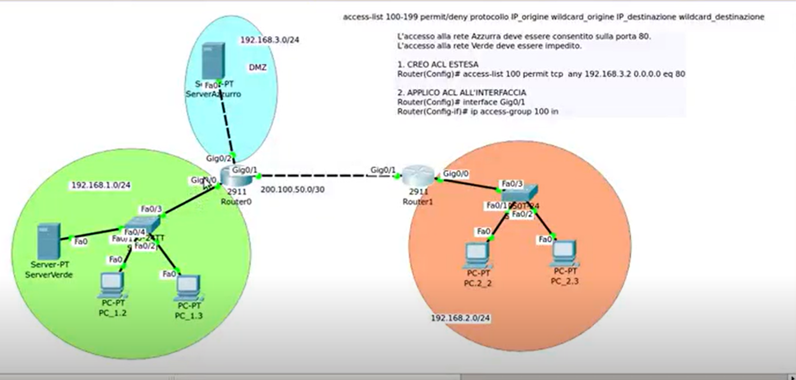

Certo. Qui la parte **DMZ + ACL estese + proxy** va capita bene, perché è un caso molto tipico da maturità e mette insieme sicurezza, posizionamento delle regole e differenza tra traffico **esterno**, **DMZ** e **LAN interna**.

---

# 1) DMZ

## COS’È

La **DMZ** (_Demilitarized Zone_) è una zona di rete separata, posta tra Internet e la LAN aziendale.

Dentro la DMZ si mettono i servizi che devono essere accessibili dall’esterno, per esempio:

- un **server web**
    
- un server email
    
- un servizio pubblico
    

L’idea è questa: il server deve essere visibile da Internet, ma la **LAN interna** deve restare protetta.

## A COSA SERVE

Serve per pubblicare un servizio su Internet senza esporre tutta la rete aziendale.

Quindi:

- dall’esterno posso raggiungere il server della DMZ
    
- dall’esterno **non** posso entrare liberamente nella LAN
    
- se il server viene compromesso, il danno resta più limitato
    

## COME FUNZIONA

La rete aziendale viene divisa in almeno tre parti:

- **Internet / rete esterna**
    
- **DMZ**
    
- **LAN interna**
    

Il traffico dall’esterno può arrivare al server della DMZ, ma non deve poter passare liberamente verso la LAN.

Questa è la differenza fondamentale rispetto a una rete senza DMZ: qui il server pubblico non sta nella LAN privata, ma in una zona separata e più controllata.

---

# 2) ACL estesa nella DMZ

## COS’È

In questo caso la **ACL estesa** serve a filtrare il traffico in modo preciso:

- per **protocollo**
    
- per **IP sorgente**
    
- per **IP destinazione**
    
- per **porta**
    

## A COSA SERVE

Serve per dire, per esempio:

- chi dall’esterno può raggiungere il server pubblico
    
- quali servizi sono permessi
    
- quali risposte TCP possono tornare nella LAN
    
- quali accessi alla LAN devono essere bloccati
    

## COME FUNZIONA

Qui la logica è diversa rispetto ai casi precedenti.

Nei video precedenti tu eri nella LAN e potevi ragionare “vicino alla sorgente” oppure “vicino alla destinazione”.  
Con la DMZ il punto importante è un altro:

> non posso andare a configurare i router di Internet uno per uno.  
> Posso agire solo sul **router di confine** della mia azienda.

Quindi la ACL si mette sull’interfaccia del router che guarda verso l’esterno, cioè verso Internet, e si applica **in inbound**.

Questo è molto importante:

- il traffico entra nel router dalla rete esterna
    
- quindi la ACL controlla i pacchetti **in ingresso**
    
- non ha senso provare a filtrare sui router del web, perché non li gestisco io
    

---

# 3) Caso del server pubblico in DMZ

## OBIETTIVO

Permettere:

- accesso al server web in DMZ solo sul servizio HTTP
    

Bloccare:

- accessi non autorizzati
    
- tentativi di entrare nella LAN interna
    

### Comando

```bash
access-list 100 permit tcp any 192.168.3.2 0.0.0.0 eq 80
```

Oppure in forma equivalente:

```bash
access-list 100 permit tcp any host 192.168.3.2 eq 80
```

---

## SPIEGAZIONE DEL COMANDO

Questa regola significa:

- **permit** → consenti
    
- **tcp** → il protocollo è TCP
    
- **any** → può partire da qualunque host esterno
    
- **192.168.3.2** → destinazione: il server nella DMZ
    
- **0.0.0.0** → corrispondenza esatta dell’host
    
- **eq 80** → solo porta 80, quindi servizio HTTP
    

Quindi:

> dall’esterno posso raggiungere il server della DMZ solo per il servizio web HTTP sulla porta 80

### Punto importante

`any` sostituisce la coppia IP + wildcard quando vuoi indicare **tutti gli indirizzi possibili**.  
È una scorciatoia molto usata nelle ACL Cisco.

---

# 4) Accesso verso la LAN: traffico di risposta TCP

Nel tuo video c’è un punto molto importante: la LAN deve poter ricevere le **risposte** di una connessione già avviata.

Per esempio:

- un client della LAN apre un sito web nella DMZ o su Internet
    
- il server risponde
    
- la risposta deve tornare indietro
    

Per consentire questo, si usa:

```bash
access-list 100 permit tcp any 192.168.1.0 0.0.0.255 established
```

## COSA SIGNIFICA

Questa regola permette il traffico TCP verso la rete verde **solo se la connessione è già stata stabilita**.

### `established`

`established` non significa “connessione perfetta” in senso generico.  
Significa che il pacchetto TCP ha i flag necessari, in pratica quelli usati per indicare una sessione già avviata, tipicamente **ACK** o **RST**.

Questa regola serve a dire:

> accetta solo le risposte di connessioni già iniziate dall’interno

Quindi:

- una richiesta nuova dall’esterno verso la LAN viene bloccata
    
- una risposta a una sessione già iniziata può passare
    

---

# 5) Perché questa soluzione è diversa dalle ACL precedenti

## CASO PRECEDENTE

Prima bloccavi una rete o un host in modo diretto.

## CASO DMZ

Qui invece devi distinguere tre cose:

- traffico dall’esterno verso il server pubblico
    
- traffico di risposta verso la LAN
    
- traffico che non deve mai entrare nella LAN
    

Quindi la regola deve essere più fine e più sicura.

### Punto chiave

Non basta dire “blocca tutto” oppure “permetti tutto”.

Devi:

- permettere l’accesso al servizio pubblico
    
- permettere solo le risposte TCP già stabilite
    
- bloccare tutto il resto per proteggere la LAN
    

---

# 6) Dove si applica la ACL nella DMZ

Questo è il punto più importante della tua domanda.

## COS’È

La ACL va applicata sul **router di confine**, nella porta che guarda verso Internet.

## A COSA SERVE

Serve a controllare il traffico prima che entri nella rete aziendale.

## COME FUNZIONA

Nel tuo esempio:

```bash
interface Gig0/1
ip access-group 100 in
```

Significa che la ACL viene controllata:

- **in ingresso** sull’interfaccia `Gig0/1`
    
- cioè sul lato che riceve il traffico esterno
    

### Da ricordare bene

In una DMZ, la regola non si mette “dove capita”, ma:

- sull’interfaccia del router di confine
    
- dalla parte in cui entra il traffico da Internet
    
- quindi **inbound**
    

---

# 7) Esempio completo della logica DMZ

Immagina:

- LAN interna: `192.168.1.0/24`
    
- DMZ: server web `192.168.3.2`
    
- Internet: rete esterna
    

La ACL dice:

1. permetti a chiunque di raggiungere il server web della DMZ sulla porta 80
    
2. permetti solo le risposte TCP già stabilite verso la LAN
    
3. blocca tutto il resto
    

Così ottieni:

- servizio pubblico accessibile
    
- LAN protetta
    
- regole chiare e precise
    

---

# 8) Proxy

## COS’È

Il **proxy** è un server intermedio tra client e destinazione.

Può essere usato per:

- caching
    
- filtraggio
    
- logging
    
- mascheramento dell’IP
    

## A COSA SERVE

Serve per controllare e ottimizzare il traffico, soprattutto web.

## COME FUNZIONA

Il client non va direttamente al server finale.  
Passa prima dal proxy, che può:

- memorizzare una copia della pagina in cache
    
- bloccare siti non autorizzati
    
- registrare le richieste
    
- inoltrare la richiesta verso il web server
    

---

## PROXY E CACHE

La cache serve a non rifare continuamente la stessa richiesta al server.

Se una pagina è già stata richiesta, il proxy può rispondere usando la copia salvata.  
Questo:

- riduce il traffico
    
- accelera la risposta
    
- alleggerisce il server web
    

### Svantaggio

Potresti vedere una versione vecchia della pagina se la cache non è aggiornata.

---

## PROXY E LOG

Il proxy può salvare i log, cioè:

- chi ha richiesto una pagina
    
- quando
    
- per quanto tempo
    
- quali siti sono stati visitati
    

Questo è utile per controllo e audit.

---

## PROXY E MASCHERAMENTO IP

Il proxy può nascondere l’IP del client verso l’esterno, perché il sito vede il proxy come mittente.

### Correzione importante

Il proxy **non cifra il traffico come una VPN**.  
La VPN crea un tunnel cifrato; il proxy no, almeno non per definizione.

Quindi:

- **proxy** = intermediario applicativo
    
- **VPN** = tunnel cifrato
    

Sono strumenti diversi.

---

## FORWARD PROXY E REVERSE PROXY

### Forward proxy

Lo usano i **client** per uscire verso Internet.

### Reverse proxy

Stà davanti a uno o più server interni e serve per:

- protezione
    
- bilanciamento del carico
    
- smistamento delle richieste
    
- difesa dei server pubblici
    

---

# 9) Differenze importanti: DMZ, ACL e proxy

- **DMZ** = zona di rete separata per servizi pubblici
    
- **ACL** = regole che filtrano il traffico
    
- **proxy** = intermediario applicativo con cache e controllo richieste
    

Possono lavorare insieme, ma non fanno la stessa cosa.

---

# 10) RIASSUNTO FINALE

La DMZ è una zona intermedia tra Internet e la LAN aziendale, usata per esporre servizi pubblici senza esporre tutta la rete interna.  
Le ACL estese nella DMZ vanno applicate sul router di confine, di solito sull’interfaccia verso Internet, in ingresso.  
Si possono consentire solo i servizi necessari, per esempio HTTP verso il server pubblico, e solo le risposte TCP già stabilite verso la LAN.  
Il proxy invece è un intermediario applicativo che può filtrare, registrare e cachare le pagine, ma non sostituisce la VPN.

---

# DOMANDE POSSIBILI DA MATURITÀ

- Che cos’è una **DMZ** e perché si usa?
    
- Dove si applica una **ACL estesa** in una rete con DMZ?
    
- Cosa significa il comando `established` in una ACL?
    
- Qual è la differenza tra **proxy e VPN**?
    
- Perché una DMZ è più sicura di una rete in cui il server pubblico sta nella LAN?
    

---

[CONTROLLO STUDIO]

- ✔ Corretto: DMZ come zona separata tra Internet e LAN, ACL estesa applicata sul router di confine in inbound, regola `permit tcp any host 192.168.3.2 eq 80`, uso di `established` per traffico TCP già avviato, proxy come intermediario con cache/log.
    
- ⚠ Correzioni: `established` non “apre” una connessione in generale, ma consente solo il traffico TCP di risposta già stabilita; il proxy non cripta il traffico come una VPN; il filtro va fatto sul router di confine, non sui router di Internet.
    
- ➕ Integrazioni utili: differenza tra forward proxy e reverse proxy, significato pratico di `any`, distinzione tra traffico verso il server DMZ e traffico verso la LAN interna.
    
- ❌ Non trattato: configurazione completa di DMZ con più interfacce, reverse proxy in dettaglio, differenze con firewall stateful avanzati.
    

[DA RICORDARE]

- concetto chiave: la DMZ ospita i servizi pubblici senza esporre la LAN interna.
    
- errore comune: mettere la ACL nel punto sbagliato della rete o pensare che `established` significhi “sicuro” in senso assoluto.
    
- collegamento utile: DMZ, ACL e proxy sono tre strumenti diversi ma complementari per proteggere e controllare il traffico di rete.


Si è aggiunta una parte piu avanzata di ACL estese, inanzitutto spiega bene il contesto e come mai in questa situazione ci serve lavorare in modo diverso e poi ovviamente cosa si fa e tutta una spiegazione relativa perfetta per capire benissimo.
potrei non aver capito perfettamente il contesto ma ho provato ad appuntarlo, te comunque lo capirai dalla trascrizione del video:

caso molto frequente in cui abbiamo un'azienda , lan aziendale che deve eessere protetta, magari vuole pubblicare sul web i propri prodotti, e per questo deve dichiarare una zona demilitarizzata. se noi prendiamo il router collegato alla parte privata dell'azienda, nel caso in cuii creo il mio servizio online devo permettere di farlo andare verso l'esterno e di permettere ai pacchetti di entrare.
IL SERVER nella rete in cui tutto il resto è privato, permette di mantenere la protezione perche permette di comunicare solo col dispositivo in questione.

non possiamo lavorare sul router di provenienza perche in mezzo c'è la nuvoleta/cloud/web(una rete qualsiasi che si collega al server).

il problema è l'altra rete dell'azienda inizia a essere vista come una qualsiasi altra rete del web che richiede dati al server.
per questo dovro differenziale il modo in cui escludo i dati.
per farlo non posso andare su ogni singolo router mondiale dicendo che possono andare sulla rete privata,m ma devo 

any in questo caso sostituisce ip e wildcard(con any sto permettendo le cose che arrivano da chiunque).

noi stiamo applicando la regola su un'interfaccia , la regola va applicata sul traffico che entra nel router quindi inbound.\

interfaccia nel secondo caso l'acl estesa ancora sempre slla stessa stessa interfaccia 0/1
ma tramite la trascrizione del video puoi fare una spiegazione perfetta:

PROXY: è una macchina la cui particolarità è il salvataggio della pagine web in modo da prevenire il bisogno dell'accesso al server. altra funzione anche il mascheramento e modifica dell'indiirzzo ip sorgente(fa come da NAT). io sono nella mia rete con indirizzi ip privati di classe C con relativo router collegato. Auano noi facciamo una richiesta nel web il NAT si occuperà di cambiare il nostro IP in pubblico per permettere l'uscita della rete privata sul web.
se voglio oscurare l'indirizzo ip pubblico dato dal NAT, parlando del proxy , noi possiamo collegarci ad un proxy server(non interno alla mia rete, altrimenti non potrei oscurare) al quale ci collegheremo in maniera diretta, non è criptato come fosse una vpn ma mi permette di oscurare l'ip pubblico mio cambiandolo. Opzione migliore è l'uso della vpn che ho gli stessi vantaggi ma in piu ho la possibilita di avere tutto il mio traffico criptato, utile se si parla di una rete privata di un'azienda.
caso in cui voglio vedere cosa nella mia azienda viene cercato , quindi il proxy server si trova all'interno della mia rete con il proxy server collegato allo switch tramite cui gli host si collegano.
in una situazione del genere ogni richiesta che io faccio passa dal proxy. cio offre die vantaggi , ad es. questo router quando l'informazione esce questo router offrirà l'indirizzo ip pubblico e veicolerà il messaggio al proxy server e solo dopo agli host e poi il proxy pensa dove ,andare le reply.
il proxy server tiene una sorta di log con tutto cio che viene fatto.questo log dice che a un certo orario un certo utente a richiesto una certa pagina e per quanto tempo; quindi l'attivita degli utenti viene resa disponibile a chi la va richiedere e restituita tramite il log.
col proxy posso bloccare tutte le richieste su pagine che io stabilisco,  bloccando traffico indisiderato e siti web che escem, altro vantaggio cache che è cio che si trova all'interno di un proxy viene usato per rispondere a richieste di pagine senza far lavorare il server web dell'azienda. Quindi il proxy server se si parla di quello intranet( non extranet), tutto questo sistema c'è da ricordare che non cripta , cio che esce dal rpoxy va sul router  e poi si utilizza indirizzo pubblico non criptato.
il proxy puo essere anche impieghato nel router.


comandi:
access-list 100-199 permit/deny protocollo IP_origine wildcard_origine IP_destinazione wildcard_destinazione

L'accesso alla rete Azzurra deve essere consentito sulla porta 80.
L'accesso alla rete Verde deve essere impedito.

1. CREO ACL ESTESA
Router(Config)# access-list 100 permit tcp any 192.168.3.2 0.0.0.0 eq 80
2. APPLICO ACL ALL'INTERFACCIA
Router(Config)# interface Gig0/1
Router(Config-if)# ip access-group 100 in




trascrizione video:

0:02
0 minuti 2 secondi
Proseguiamo la nostra scoperta delle delle ACL esame.
0:09
0 minuti 9 secondi
Esaminiamo un caso molto frequente, il caso in cui ci sia un'azienda e la immaginiamo qui, in cui a in cui c'è una parte una lan aziendale che è questa, possiamo scrivere lan aziendale.
0:32
0 minuti 32 secondi
Che deve essere protetta e una area invece che è più pubblica, magari con un server web perché l'azienda vuole pubblicare sul web i proprio i propri prodotti.
0:47
0 minuti 47 secondi
Che quindi chiameremo DMZ che sta per zona de militarizzata. Cosa vuol dire? Dall'esterno io devo poter accedere in DMZ perché è un server pubblico, ma dall'esterno non deve essere possibile accedere alla LAN.
1:07
1 minuto 7 secondi
Il caso sembra simile al precedente, però noi dobbiamo immaginare che.
1:14
1 minuto 14 secondi
Non possiamo adesso lavorare sul router di provenienza, perché la provenienza?
1:24
1 minuto 24 secondi
È Internet, quindi noi qui ci possiamo proprio immaginare una Nuvoletta, il cloud, cioè qui non potremmo andare su tutti i router di tutti i nostri potenziali clienti e bloccare gli accessi, quindi questa volta la cella estesa va posizionata qui, perché l'unico router su cui io posso impostare le regole?
1:47
1 minuto 47 secondi
Quindi è logicamente un po diverso. Allora che cosa dovrò fare? Io voglio consentire l'accesso solo a questo server.
1:57
1 minuto 57 secondi
Solo alla porta 80, per cui va benissimo la cella estesa che sarà del tipo PERMETTI il traffico TCP perché siamo sulla porta 80?
2:09
2 minuti 9 secondi
Da qualunque host, quindi da tutto il mondo esterno verso.
2:15
2 minuti 15 secondi
Questi p.
8:30
8 minuti 30 secondi
Dall'esterno, da qualunque IP.
8:34
8 minuti 34 secondi
IP esterno però che provenga dalla porta 80, quindi a questo punto possiamo immaginare che qui ci sia un'altro server che.
8:47
8 minuti 47 secondi
È collegato.
8:51
8 minuti 51 secondi
Qua e lo chiameremo in questo caso.
8:55
8 minuti 55 secondi
Sarà il 192.168, dunque la rete è la due punto 2.4.
9:08
9 minuti 8 secondi
1921681 no 2 1, OK.
9:17
9 minuti 17 secondi
Configurazione server rosa.
9:21
9 minuti 21 secondi
OK, quindi permettiamo.
9:26
9 minuti 26 secondi
L'accesso dall'esterno che provenga dalla porta 80, perché se io prima da qua sono ho fatto accesso a un server web, serve server web che mi risponde quindi qualunque risposta proveniente da qualunque IP dalla porta ottenta, cioè da un server web diretto verso la rete uno, cioè tutta la rete Verde Consenteglielo, ma solo se è già stata stabilita la connessione, cioè se in precedenza.
9:52
9 minuti 52 secondi
Questa questa richiesta è stata fatta dalla rete verde.
9:57
9 minuti 57 secondi
OK.
10:00
10 minuti
Aggiungiamo quindi Queen all'access list 100.
10:06
10 minuti 6 secondi
Quindi aggiungiamo questa regola, Access list 100 permit TCP da qualunque host ma solo proveniente dall'ottanta.
10:19
10 minuti 19 secondi
1921681 a zero che è la rete verde 000255 establishd.
10:31
10 minuti 31 secondi
OK, allora?
10:36
10 minuti 36 secondi
Vediamo se stavolta dunque qui serve il rosa.
10:40
10 minuti 40 secondi
Servizi http sono mettiamo.
10:48
10 minuti 48 secondi
Okay, sono il server rosa.
10:54
10 minuti 54 secondi
Vediamo se ci accede adesso, prima non si riusciva, vediamo.
11:01
11 minuti 1 secondo
Se riusciamo andare in 19216824?
11:08
11 minuti 8 secondi
E lui risponde.
11:11
11 minuti 11 secondi
Perché questa volta?
11:14
11 minuti 14 secondi
La. Alla richiesta è seguito una risposta che era sulla porta 80 per.
11:23
11 minuti 23 secondi
Diretta verso la uno a zero.
11:27
11 minuti 27 secondi
Come ultima prova ancora vediamo se il server rosa volesse accedere alla rete verde, quindi se questa questo traffico non.
11:39
11 minuti 39 secondi
È una risposta ad una connessione già stabilita, cioè una richiesta dalla Verde che ritorna quindi che già stata stabilita, ma è una nuova richiesta proveniente da questo server. Vediamo un po adesso se.
11:55
11 minuti 55 secondi
E qui lo possiamo fare per esempio. Ecco, creiamo una nuova. Vediamo un po. Se riusciamo, allora vediamo.
12:06
12 minuti 6 secondi
E andiamo.
12:08
12 minuti 8 secondi
Qui.
12:11
12 minuti 11 secondi
Scusate, mettiamoci un poco qua.
12:16
12 minuti 16 secondi
OK, andiamo qui.
12:20
12 minuti 20 secondi
La facciamo una richiesta proveniente dall'ottanta verso il server verde per esempio, quindi?
12:29
12 minuti 29 secondi
Http destinata a 19216814 e?
12:41
12 minuti 41 secondi
Da portarsi e poi mettiamo come porta sorgente alla 80.
12:46
12 minuti 46 secondi
13:00
13 minuti
Allora questa è in Progress e la cancelliamo e rifacciamo?
13:06
13 minuti 6 secondi
Avete pazienza allora? HTTP 192 168 e.
13:14
13 minuti 14 secondi
1480.
13:17
13 minuti 17 secondi
80.
13:19
13 minuti 19 secondi
100 100.
13:23
13 minuti 23 secondi
Video.
13:25
13 minuti 25 secondi
Vai alla pagina iniziale.
13:34
13 minuti 34 secondi
Vedete che viene bloccata, arriva qua e non accede. Che cosa ho fatto? Ho creato una Pd.
13:42
13 minuti 42 secondi
U complessa che non era che in cui ho specificato che il il mittente era 80. Questa volta però viene bloccata qua non riesce a passare perché questo router si accorge che il server che ha iniziato un accesso quindi sarà un tentativo di attacco e non il server che risponde a una richiesta proveniente dalla rete.
14:08
14 minuti 8 secondi
Dalla rete.
14:09
14 minuti 9 secondi
Dalla lan aziendale, cioè dalla rete verde.